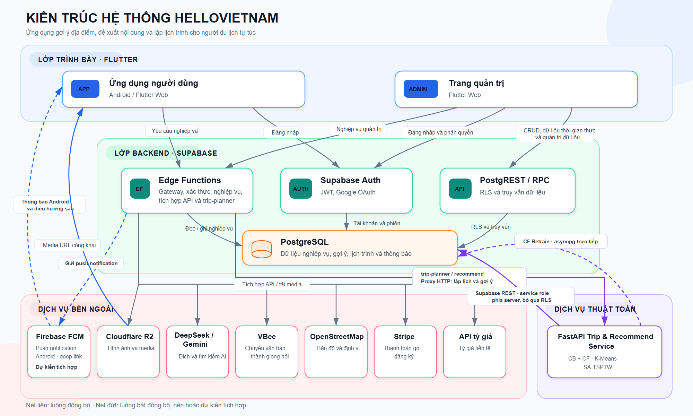

TRƯỜNG ĐẠI HỌC KHOA HỌC TỰ NHIÊN

**KHOA CÔNG NGHỆ THÔNG TIN**

**Phan Lê Đức Anh \- Lê Trần Kim Oanh**

**Nguyễn Gia Phúc \- Cao Phạm Hoàng Thái** 

**ỨNG DỤNG GỢI Ý LỊCH TRÌNH**

**CHO NGƯỜI DU LỊCH TỰ TÚC**

THỰC TẬP DỰ ÁN TỐT NGHIỆP CỬ NHÂN CNTT

CHƯƠNG TRÌNH CHẤT LƯỢNG CAO

Thành phố Hồ Chí Minh, 2026

**TRƯỜNG ĐẠI HỌC KHOA HỌC TỰ NHIÊN**

**KHOA CÔNG NGHỆ THÔNG TIN**

Phan Lê Đức Anh (22127020)

Lê Trần Kim Oanh (22127319) 

Nguyễn Gia Phúc (22127331)

Cao Phạm Hoàng Thái (22127382)

**XÂY DỰNG ỨNG DỤNG HỖ TRỢ NGƯỜI NƯỚC NGOÀI DU LỊCH TẠI VIETNAM**

**THỰC TẬP DỰ ÁN TỐT NGHIỆP CỬ NHÂN CNTT**

**CHƯƠNG TRÌNH CHẤT LƯỢNG CAO**

**GIẢNG VIÊN HƯỚNG DẪN**

ThS. Tiết Gia Hồng (Khoa Công nghệ Thông tin) 

Thành phố Hồ Chí Minh, 2026

**Lời cảm ơn**

Đồ án tốt nghiệp chuyên ngành Hệ thống thông tin với đề tài **“Xây dựng ứng dụng hỗ trợ người nước ngoài du lịch tại Việt Nam”** là kết quả của quá trình học tập, nghiên cứu và thực hiện nghiêm túc của nhóm, cùng với sự hỗ trợ quý báu từ Thầy, Cô, gia đình và bạn bè.

Trước hết, chúng em xin bày tỏ lòng biết ơn sâu sắc đến **Thạc sĩ Tiết Gia Hồng**, người đã tận tình hướng dẫn, định hướng và đóng góp nhiều ý kiến thiết thực trong suốt quá trình thực hiện đề tài. Sự hỗ trợ và những nhận xét chuyên môn của Cô là nền tảng quan trọng giúp nhóm từng bước hoàn thiện sản phẩm và báo cáo.

Chúng em cũng xin chân thành cảm ơn Ban Giám hiệu Trường Đại học Khoa học Tự nhiên, Đại học Quốc gia Thành phố Hồ Chí Minh, Khoa Công nghệ Thông tin cùng quý Thầy, Cô trong bộ môn đã tạo điều kiện thuận lợi, truyền đạt kiến thức và hỗ trợ nhóm trong quá trình học tập và thực hiện đồ án.

Bên cạnh đó, chúng em xin gửi lời cảm ơn đến gia đình, bạn bè và người thân đã luôn động viên, chia sẻ và đóng góp những góc nhìn đa chiều, giúp chúng em có thêm động lực để hoàn thành đề tài một cách tốt nhất.

Mặc dù đã dành nhiều thời gian và nỗ lực trong quá trình thực hiện, do giới hạn về thời gian, kinh nghiệm và nguồn lực, đồ án khó tránh khỏi những thiếu sót. Chúng em rất mong nhận được những ý kiến nhận xét và góp ý từ quý Thầy, Cô và bạn đọc để đề tài có thể được tiếp tục hoàn thiện trong tương lai.

TP. Hồ Chí Minh, ngày 20 tháng 07 năm 2026

**Nhóm tác giả**

**Danh sách bảng**

**Danh sách hình**

**Danh sách từ viết tắt và thuật ngữ**

| STT | Viết tắt | Viết đầy đủ |
| ----- | ----- | ----- |
| 1 |  |  |
| 2 |  |  |
| 3 |  |  |
| 4 |  |  |
| 5 |  |  |
| 6 |  |  |
| 7 |  |  |
| 8 |  |  |
| 9 |  |  |
| 10 |  |  |
| 11 |  |  |
| 12 |  |  |
| 13 |  |  |
| 14 |  |  |

**TÓM TẮT**

*\[Trình bày ngắn gọn bối cảnh và vấn đề: du lịch tự túc phát triển mạnh nhưng việc lên kế hoạch cá nhân hóa còn tốn nhiều công sức. HelloVietnam ra đời nhằm giải quyết bài toán này.\]*

*\[Mô tả ngắn phương pháp: hệ thống sử dụng ba module – gợi ý địa điểm (CB \+ CF/WALS), phân cụm theo ngày (K-Means \+ Greedy Repair), và tối ưu lộ trình (SA với TSPTW) – tích hợp qua API FastAPI với hai frontend Flutter.\]*

*\[Nêu kết quả chính: sản phẩm đầu ra, kết quả đánh giá thuật toán (Precision@K, F1-score), thời gian phản hồi, và phản hồi từ khảo sát người dùng.\]*

[**Chương 1: GIỚI THIỆU	11**](#heading=)

[**1.1.Đặt vấn đề	11**](#heading=)

[**1.2.Mục tiêu và hướng tiếp cận	11**](#heading=)

[**Chương 2: CÁC HỆ THỐNG VÀ CÔNG NGHỆ LIÊN QUAN	12**](#heading=)

[**2.1.Các hệ thống hỗ trợ du lịch hiện có	12**](#heading=)

[**2.2.Các công nghệ và thuật toán được áp dụng	12**](#heading=)

[**2.2.1.Hệ thống gợi ý (Recommendation Systems)	12**](#heading=)

[**2.2.3.Tối ưu lộ trình – TSP với ràng buộc thời gian (TSPTW)	13**](#heading=)

[**2.2.4.Công nghệ phát triển hệ thống	13**](#heading=)

[**Chương 3: ỨNG DỤNG HELLOVIETNAM	15**](#heading=)

[3.1.Kiến trúc hệ thống	15](#3.1.kiến-trúc-hệ-thống)

[**3.2.Thuật toán gợi ý và tối ưu lịch trình	15**](#heading=)

[**3.2.1.Module 1 – Gợi ý và chọn địa điểm	15**](#heading=)

[**3.2.2.Module 2 – Phân cụm địa điểm theo ngày	17**](#heading=)

[**3.1.3.Module 3 – Tối ưu lộ trình trong ngày (SA-TSPTW)	20**](#heading=)

[**3.3.Thiết kế các thành phần	20**](#heading=)

[**3.3.1.Dữ liệu	20**](#heading=)

[**3.3.2.Sơ đồ use-case	21**](#heading=)

[**3.3.3.Lược đồ cơ sở dữ liệu	21**](#heading=)

[Chương 4: CÀI ĐẶT VÀ ĐÁNH GIÁ	21](#chương-4:-cài-đặt-và-đánh-giá)

[**4.1.Hướng dẫn cài đặt	21**](#heading=)

[**4.2.Cài đặt các màn hình	22**](#heading=)

[**4.3.Đánh giá hiệu năng	22**](#heading=)

[**4.4.Đánh giá thuật toán	22**](#heading=)

[**4.5.Đánh giá độ hữu ích	23**](#heading=)

[**Chương 5: KẾT LUẬN	24**](#heading=)

[**5.1.Kiến thức	24**](#heading=)

[**5.2.Khó khăn trong quá trình thực hiện	24**](#heading=)

[**5.3.Sản phẩm đạt được	24**](#heading=)

[5.4. Hướng phát triển	24](#5.4.-hướng-phát-triển)

# **Chương 1: GIỚI THIỆU**

## **1.1.Đặt vấn đề**

*\[Phân tích bối cảnh: xu hướng du lịch tự túc (FIT) tại Việt Nam, số liệu UNWTO, Booking.com hoặc các nguồn khác về mức độ phổ biến. Chỉ ra những khó khăn cụ thể người dùng gặp phải khi tự lên kế hoạch: quá nhiều nguồn thông tin, khó cá nhân hóa, khó tối ưu lộ trình di chuyển giữa các địa điểm.\]*

*\[Từ đó đặt vấn đề cho đồ án: cần một công cụ có thể đồng thời gợi ý địa điểm phù hợp sở thích và tối ưu lịch trình theo ràng buộc thực tế (giờ mở cửa, khoảng cách, số ngày).\]*

Trong bối cảnh du lịch Việt Nam phục hồi mạnh mẽ sau đại dịch, ngành du lịch tiếp tục giữ vai trò quan trọng trong phát triển kinh tế, xã hội. Theo Cục Du lịch Quốc gia Việt Nam, năm 2024, Việt Nam đón khoảng 17,6 triệu lượt khách quốc tế, phục vụ 110 triệu lượt khách nội địa và đạt tổng thu từ khách du lịch khoảng 840 nghìn tỷ đồng \[1\]. Những kết quả này cho thấy thị trường du lịch Việt Nam có quy mô lớn và còn nhiều tiềm năng tăng trưởng. Việc mở rộng chính sách thị thực, cải thiện hạ tầng và đẩy mạnh quảng bá điểm đến cũng góp phần nâng cao sức hấp dẫn của Việt Nam đối với du khách quốc tế.

Cùng với sự phục hồi của thị trường, du lịch tự túc, thường được gọi là FIT (Free Independent Traveller), ngày càng trở nên phổ biến. Khác với hình thức tham gia tour trọn gói, khách du lịch tự túc chủ động lựa chọn điểm đến, thời gian, phương tiện, nơi lưu trú và các hoạt động trong chuyến đi. Theo Decision Lab, 57% người tham gia khảo sát tại Việt Nam ưu tiên tự lập kế hoạch và đặt các dịch vụ cần thiết, trong khi 27% lựa chọn tour trọn gói và 16% kết hợp cả hai hình thức \[5\]. Điều này cho thấy du khách ngày càng đề cao tính linh hoạt, khả năng kiểm soát hành trình và mức độ phù hợp với nhu cầu cá nhân.

Bên cạnh đó, chuyển đổi số đang trở thành một định hướng quan trọng của ngành du lịch Việt Nam. Theo Cổng Thông tin điện tử Chính phủ, Đề án ứng dụng công nghệ của công nghiệp 4.0 trong phát triển du lịch đặt mục tiêu xây dựng hệ sinh thái du lịch thông minh, phát triển các nền tảng và ứng dụng phục vụ khách du lịch, thúc đẩy hoạt động kinh doanh trực tuyến và nâng cao trải nghiệm người dùng \[2\]. Vì vậy, việc ứng dụng công nghệ vào hoạt động du lịch không còn chỉ mang tính hỗ trợ mà đang trở thành yêu cầu cần thiết để nâng cao chất lượng dịch vụ và năng lực cạnh tranh.

Tuy mang lại sự chủ động, du lịch tự túc cũng đặt ra nhiều khó khăn trong quá trình chuẩn bị. Thông tin về địa điểm, văn hóa, ẩm thực, giờ hoạt động, mức giá và phương thức di chuyển thường phân tán trên nhiều website, mạng xã hội, blog và ứng dụng bản đồ. Người dùng phải dành nhiều thời gian để tìm kiếm, tổng hợp và đánh giá độ tin cậy của thông tin. Khi số lượng nguồn và lựa chọn tăng lên, người dùng dễ gặp tình trạng quá tải thông tin và khó xác định những địa điểm thực sự phù hợp.

Việc lựa chọn và xây dựng lịch trình cũng không đơn giản vì mỗi người có sở thích, ngân sách, thời gian và mục đích du lịch khác nhau. Các danh sách địa điểm phổ biến thường được xây dựng theo xu hướng chung, chưa phản ánh đầy đủ nhu cầu cá nhân. Sau khi chọn được địa điểm, người dùng còn phải phân bổ chúng vào từng ngày và sắp xếp thứ tự tham quan sao cho phù hợp với khoảng cách, thời gian di chuyển, thời lượng tham quan, giờ mở cửa và số ngày của chuyến đi. Nếu sắp xếp không hợp lý, lịch trình có thể làm tăng quãng đường di chuyển, phát sinh thời gian chờ hoặc không thể hoàn thành trong thực tế.

Những khó khăn này càng rõ rệt đối với khách nước ngoài khi đến Việt Nam. Ngoài việc tìm kiếm và kiểm chứng thông tin, họ còn có thể gặp trở ngại về ngôn ngữ, giao tiếp, chỉ dẫn và sử dụng dịch vụ tại điểm đến. Theo nghiên cứu của Booking.com, 44% du khách cho biết rào cản ngôn ngữ có thể khiến họ chần chừ khi lên kế hoạch cho chuyến đi, trong khi 18% lo ngại bị lạc khi không thể sử dụng ngôn ngữ địa phương \[3\]. Khách quốc tế cũng có thể gặp khó khăn khi tìm hiểu phong tục, văn hóa, ẩm thực và phương thức di chuyển tại Việt Nam.

Trong khi đó, nhu cầu sử dụng các công cụ thông minh để hỗ trợ lập kế hoạch du lịch ngày càng gia tăng. Theo khảo sát toàn cầu của Booking.com, 41% người tham gia quan tâm đến việc sử dụng lịch trình được cá nhân hóa bằng trí tuệ nhân tạo trong quá trình lên kế hoạch \[4\]. Điều này cho thấy nhu cầu của người dùng đã chuyển từ tra cứu thông tin đơn thuần sang mong muốn được hỗ trợ chọn lọc địa điểm, cá nhân hóa gợi ý và xây dựng hành trình phù hợp với điều kiện thực tế.

Từ những vấn đề trên, cần xây dựng một công cụ có khả năng đồng thời lựa chọn và xếp hạng các địa điểm phù hợp với sở thích của người dùng, đồng thời phân bổ và sắp xếp các địa điểm theo số ngày, vị trí địa lý, khoảng cách di chuyển và giờ hoạt động. Việc kết hợp giữa gợi ý cá nhân hóa và tối ưu lịch trình có thể giúp giảm thời gian chuẩn bị, hạn chế các chặng di chuyển không cần thiết và nâng cao tính khả thi của chuyến đi.

Xuất phát từ cơ sở đó, đề tài “Xây dựng ứng dụng hỗ trợ người nước ngoài du lịch tại Việt Nam” được đề xuất nhằm phát triển ứng dụng HelloVietnam theo hướng thông minh và cá nhân hóa. Ứng dụng hướng đến khách du lịch tự túc tại Việt Nam, đặc biệt là khách nước ngoài, với các chức năng như tìm kiếm và khám phá địa điểm, gợi ý nội dung phù hợp với sở thích, tự động xây dựng lịch trình, hỗ trợ ngôn ngữ, cung cấp thông tin văn hóa và ẩm thực, nhận diện món ăn hoặc đồ vật bằng hình ảnh và kết nối du khách với người dân bản địa.

Thông qua đó, HelloVietnam góp phần giảm thời gian và công sức khi lập kế hoạch, nâng cao trải nghiệm của khách quốc tế, hỗ trợ quảng bá các giá trị văn hóa và du lịch địa phương, đồng thời phù hợp với định hướng chuyển đổi số và phát triển hệ sinh thái du lịch thông minh tại Việt Nam.

## **1.2.Mục tiêu và hướng tiếp cận**

*\[Nêu ba mục tiêu cốt lõi: (1) xây dựng hệ thống gợi ý địa điểm cá nhân hóa; (2) tự động phân bổ địa điểm vào các ngày và tối ưu lộ trình; (3) thiết kế giao diện thân thiện, dễ dùng trong quá trình di chuyển.\]*

*\[Trình bày hướng tiếp cận chính: ba module thuật toán (CB+CF, K-Means+Greedy, SA-TSPTW), stack kỹ thuật (Supabase, FastAPI, Flutter), và phạm vi dữ liệu (các tỉnh thành Việt Nam).\]*

Như đã trình bày ở phần 1.1, khách du lịch tự túc, đặc biệt là khách nước ngoài khi đến Việt Nam, thường gặp khó khăn trong việc tìm kiếm thông tin, lựa chọn địa điểm phù hợp và xây dựng lịch trình có tính khả thi. Xuất phát từ những vấn đề đó, ứng dụng HelloVietnam được xây dựng nhằm hỗ trợ người dùng trong quá trình khám phá địa điểm, lập kế hoạch và trải nghiệm du lịch tại Việt Nam.

Đề tài tập trung vào ba mục tiêu cốt lõi. **Thứ nhất,** xây dựng hệ thống gợi ý địa điểm cá nhân hóa dựa trên sở thích, ngân sách và hành vi tương tác của người dùng. **Thứ hai**, tự động phân bổ các địa điểm vào từng ngày và tối ưu thứ tự tham quan dựa trên vị trí địa lý, khoảng cách, thời gian di chuyển, giờ hoạt động và thời lượng tham quan. **Thứ ba,** thiết kế ứng dụng di động có giao diện trực quan, dễ thao tác và phù hợp với nhu cầu sử dụng trong quá trình di chuyển.

Để thực hiện các mục tiêu trên, hệ thống gợi ý lịch trình được tổ chức thành **ba module thuật toán liên kết với nhau.** Module đầu tiên kết hợp Content-Based Filtering và Collaborative Filtering để lựa chọn, tính điểm và xếp hạng các địa điểm phù hợp với từng người dùng. Module thứ hai sử dụng K-Means để phân cụm địa điểm theo số ngày du lịch, sau đó áp dụng Greedy Repair nhằm điều chỉnh số lượng địa điểm giữa các ngày. Module cuối cùng tiếp cận bài toán TSPTW và sử dụng Simulated Annealing để tối ưu thứ tự tham quan, có xét đến thời gian di chuyển, giờ mở cửa, thời gian chờ, thời lượng tham quan, thời gian nghỉ trưa và giới hạn kết thúc trong ngày.

**Về công nghệ triển khai,** ứng dụng sử dụng Flutter và Dart để xây dựng giao diện trên thiết bị di động; FastAPI và Python để phát triển các dịch vụ gợi ý, lập kế hoạch và tối ưu lịch trình; Supabase để quản lý cơ sở dữ liệu PostgreSQL, xác thực người dùng và cung cấp các API hoặc Edge Function hỗ trợ. Hệ thống cũng tích hợp OpenStreetMap và các dịch vụ định vị để hiển thị bản đồ, tìm kiếm địa điểm lân cận và hỗ trợ di chuyển.

Ngoài ra, HelloVietnam sử dụng Google ML Kit và DeepSeek để hỗ trợ dịch thuật, Gemini cho chức năng tìm kiếm bằng trí tuệ nhân tạo, Vbee cho chuyển văn bản thành giọng nói và Cloudflare R2 để lưu trữ hình ảnh, tệp đa phương tiện. Các dịch vụ bên ngoài được gọi thông qua backend hoặc Edge Function nhằm bảo vệ thông tin xác thực và chuẩn hóa dữ liệu trước khi trả về ứng dụng.

Phạm vi dữ liệu của đề tài tập trung vào các tỉnh, thành phố và địa điểm du lịch tại Việt Nam. Dữ liệu địa điểm bao gồm các thông tin cơ bản như tên, mô tả, danh mục, thẻ nội dung, tọa độ địa lý, mức giá, điểm đánh giá, giờ hoạt động và thời lượng tham quan dự kiến. Trước khi được sử dụng để gợi ý và lập lịch trình, dữ liệu được kiểm tra và lọc theo trạng thái hoạt động, mức ngân sách, chất lượng đánh giá và tính đầy đủ của thông tin vị trí.

# **Chương 2: CÁC HỆ THỐNG VÀ CÔNG NGHỆ LIÊN QUAN**

## **2.1.Các hệ thống hỗ trợ du lịch hiện có**

*\[Khảo sát và so sánh các ứng dụng lên lịch trình tự động hiện có (ví dụ: Google Travel, TripIt, Inspirock, TripHobo, các ứng dụng Việt Nam nếu có). Phân tích điểm mạnh và hạn chế của từng giải pháp theo các tiêu chí: gợi ý cá nhân hóa, tối ưu lộ trình, hỗ trợ offline, dữ liệu địa điểm Việt Nam. Từ đó chỉ ra khoảng trống mà HelloVietnam hướng đến.\]*

*Bảng 2.1.1: So sánh các ứng dụng hỗ trợ du lịch hiện có*

*\[\[Chèn bảng so sánh tại đây\]\]*

## **2.2.Các công nghệ và thuật toán được áp dụng**

*\[Tổng quan lý thuyết về các kỹ thuật nền tảng. Mỗi mục gồm: giới thiệu lý thuyết, công thức toán học cốt lõi (nếu có), ưu nhược điểm, và lý do liên quan đến bài toán này.\]*

### **2.2.1.Hệ thống gợi ý (Recommendation Systems)**

*\[Trình bày Content-Based Filtering: vector hóa thuộc tính địa điểm (tag, category), độ tương đồng cosine. So sánh với Collaborative Filtering (matrix factorization, WALS, implicit feedback). Giải thích công thức kết hợp explicit/implicit signals và cơ sở lý thuyết của trọng số w\_e, w\_i. Nêu bài toán cold start và cách tiếp cận trong HelloVietnam.\]*

Content-Based Filtering là một phương pháp gợi ý dựa trên đặc trưng của đối tượng và hồ sơ sở thích của người dùng. Ý tưởng chính của phương pháp này là hệ thống sẽ phân tích những đặc điểm mà người dùng quan tâm, sau đó tìm và đề xuất các đối tượng có đặc trưng tương tự.

Trong bài toán du lịch, đối tượng cần gợi ý có thể là địa điểm tham quan, nhà hàng, quán cà phê, hoạt động trải nghiệm hoặc sản phẩm địa phương. Mỗi đối tượng có thể được mô tả thông qua các đặc trưng như danh mục, tag, mô tả, mức giá, khu vực, thời lượng tham quan hoặc loại trải nghiệm. Trong khi đó, hồ sơ người dùng có thể được xây dựng từ sở thích ban đầu, lựa chọn trong chuyến đi hoặc hành vi tương tác của người dùng trong quá trình sử dụng hệ thống.

Quy trình chung của Content-Based Filtering gồm ba bước chính. Đầu tiên, hệ thống xây dựng hồ sơ sở thích của người dùng. Tiếp theo, hệ thống biểu diễn các đối tượng cần gợi ý bằng các đặc trưng nội dung. Cuối cùng, hệ thống so khớp hồ sơ người dùng với đặc trưng của từng đối tượng để xác định mức độ phù hợp và tạo ra danh sách gợi ý.

Phương pháp này phù hợp với các hệ thống gợi ý địa điểm du lịch vì không phụ thuộc quá nhiều vào dữ liệu hành vi của cộng đồng. Ngay cả khi người dùng mới chưa có nhiều lịch sử tương tác, hệ thống vẫn có thể đưa ra gợi ý dựa trên thông tin sở thích ban đầu và dữ liệu mô tả địa điểm. Ngoài ra, kết quả gợi ý cũng dễ giải thích hơn, vì hệ thống có thể cho biết một địa điểm được đề xuất do có các đặc trưng phù hợp với sở thích của người dùng.

Tuy nhiên, Content-Based Filtering cũng có một số hạn chế. Chất lượng gợi ý phụ thuộc nhiều vào chất lượng dữ liệu mô tả đối tượng. Nếu địa điểm bị thiếu tag, phân loại chưa chính xác hoặc mô tả chưa đầy đủ, kết quả gợi ý có thể bị ảnh hưởng. Bên cạnh đó, phương pháp này có thể có xu hướng đề xuất các đối tượng quá giống với sở thích đã biết của người dùng, làm giảm độ đa dạng trong danh sách gợi ý.

### **2.2.2.Tối ưu lộ trình – TSP với ràng buộc thời gian (TSPTW)**

*\[Định nghĩa bài toán TSPTW: tối thiểu tổng thời gian di chuyển với ràng buộc time window \[open\_i, close\_i\] cho mỗi địa điểm. Phân tích độ phức tạp NP-hard. Trình bày Simulated Annealing: cơ chế acceptance probability, lịch trình giảm nhiệt, neighborhood operator (2-opt swap). So sánh với Brute Force (optimal nhưng O(n\!)) và Genetic Algorithm.\]*

### **2.2.3.Công nghệ phát triển hệ thống**

*\[Giới thiệu ngắn gọn: Supabase (PostgreSQL \+ PostgREST \+ Auth), FastAPI (async Python microservice), Flutter (cross-platform mobile \+ web), OpenStreetMap/flutter\_map. Nêu lý do lựa chọn từng công nghệ.\]*

# **Chương 3: ỨNG DỤNG HELLOVIETNAM**

## **3.1.Kiến trúc hệ thống** {#3.1.kiến-trúc-hệ-thống}

HelloVietnam được xây dựng theo kiến trúc phân lớp, gồm lớp trình bày, lớp dịch vụ backend, lớp xử lý thuật toán, lớp dữ liệu và các dịch vụ tích hợp bên ngoài. Cách tổ chức này tách giao diện người dùng khỏi logic nghiệp vụ và thông tin xác thực của các dịch vụ trả phí. Nhờ đó, ứng dụng Flutter không cần kết nối trực tiếp đến các API bí mật, trong khi các thành phần backend có thể được triển khai, giám sát và nâng cấp độc lập.

**Lớp trình bày** được phát triển bằng Flutter và Dart. Cùng một mã nguồn Flutter cung cấp ứng dụng cho người dùng trên Android và Flutter Web, đồng thời có điểm khởi chạy riêng cho trang quản trị trên Web. Ứng dụng người dùng bao gồm các nhóm chức năng như xác thực, trang chủ, khám phá nội dung du lịch, wishlist, diễn đàn, dịch thuật, loyalty, thanh toán subscription và lập lịch trình. Trang quản trị cung cấp giao diện quản lý người dùng, báo cáo và các nhóm dữ liệu như tỉnh thành, địa điểm, món ăn, hoạt động, văn hóa và sản phẩm địa phương. Phần frontend sử dụng GoRouter để quản lý điều hướng; mã nguồn được chia theo feature, trong mỗi feature có các thành phần dữ liệu, mô hình và giao diện. Repository chịu trách nhiệm truy cập dữ liệu, store quản lý trạng thái và presentation hiển thị giao diện.

**Lớp backend chính** sử dụng Supabase. Supabase Auth thực hiện đăng ký, đăng nhập, Google OAuth và cấp JWT. PostgREST và các hàm RPC cung cấp giao diện truy cập PostgreSQL; Row Level Security kiểm soát bản ghi mà từng người dùng được phép đọc hoặc thay đổi. Các nghiệp vụ cần khóa bí mật, kiểm tra quyền nâng cao hoặc phối hợp nhiều dịch vụ được đặt trong Supabase Edge Functions. Một số Edge Function tiêu biểu gồm `trip-planner`, `wishlist`, `translate`, `currency-rates`, `subscription-payment`, `media-upload`, `reviews`, `ai-search` và `ai-gateway`. Trước khi xử lý, Edge Function đọc JWT từ yêu cầu, xác định người dùng hiện tại, kiểm tra dữ liệu đầu vào rồi mới truy cập cơ sở dữ liệu hoặc dịch vụ bên ngoài.

**Lớp xử lý thuật toán** là dịch vụ FastAPI viết bằng Python. Dịch vụ này chứa các thư viện và quy trình tính toán không phù hợp với môi trường Deno của Edge Functions, đặc biệt là gợi ý cộng tác và thuật toán lập lịch trình. Khi người dùng tạo lịch trình hoặc yêu cầu gợi ý, Flutter gọi Edge Function `trip-planner` hoặc `recommend`. Edge Function xác thực người dùng, kiểm tra dữ liệu đầu vào rồi proxy yêu cầu HTTP hợp lệ đến FastAPI Trip & Recommend Service. FastAPI thực hiện lựa chọn ứng viên, phân cụm theo ngày, tối ưu thứ tự tham quan và trả kết quả ngược qua Edge Function về ứng dụng. Luồng trung gian này giúp che giấu địa chỉ dịch vụ thuật toán, thông tin kết nối cơ sở dữ liệu và service role key khỏi thiết bị người dùng.

FastAPI có hai đường truy cập dữ liệu phục vụ các mục đích khác nhau. Luồng nghiệp vụ thông thường sử dụng Supabase REST thông qua `supabase-py` với service role key được giữ ở máy chủ; vì vậy luồng này bỏ qua RLS và chỉ được phép tồn tại trong môi trường backend tin cậy. Riêng tác vụ CF Retrain chạy nền sử dụng `asyncpg` và `DATABASE_URL` để kết nối trực tiếp đến PostgreSQL, phù hợp với các truy vấn huấn luyện theo lô và thao tác dữ liệu có khối lượng lớn.

**Lớp dữ liệu** sử dụng PostgreSQL do Supabase quản lý. Dữ liệu quan hệ được tổ chức theo các nhóm tài khoản, nội dung du lịch, lịch trình, diễn đàn, wishlist, đánh giá, thanh toán và loyalty. UUID được dùng làm khóa chính để hạn chế xung đột khi tạo dữ liệu từ nhiều dịch vụ. Các cột `jsonb` được sử dụng cho dữ liệu có cấu trúc linh hoạt như gallery, metadata hoặc payload thông báo; các quan hệ cốt lõi vẫn được bảo vệ bằng khóa ngoại, ràng buộc kiểm tra và chỉ mục.

**Lớp lưu trữ và tích hợp bên ngoài** gồm Cloudflare R2 cho hình ảnh và tệp đa phương tiện, OpenStreetMap cho bản đồ, DeepSeek hoặc Gemini cho các tính năng AI, Vbee cho chuyển văn bản thành giọng nói, Stripe cho thanh toán và dịch vụ tỷ giá cho chức năng tiền tệ. Ứng dụng tải media lên R2 thông qua Edge Function `media-upload`; cơ sở dữ liệu chỉ lưu URL công khai và metadata cần thiết. Các API key của AI, Vbee, Stripe và R2 được lưu trong Supabase Secrets hoặc biến môi trường của máy chủ, không được nhúng vào mã Flutter. Firebase Cloud Messaging (FCM) được thể hiện bằng nét đứt trong sơ đồ vì đây là hạng mục dự kiến tích hợp để Edge Functions gửi thông báo Android và dữ liệu điều hướng sâu đến ứng dụng; thông báo trong ứng dụng hiện tại vẫn được lưu và đọc từ PostgreSQL.

Về mặt vận hành, các truy vấn danh sách có kích thước lớn được phân trang và sắp xếp bằng chỉ mục, ví dụ feed diễn đàn, wishlist và bảng quản trị. Dữ liệu tham chiếu ít thay đổi được cache ở ứng dụng; các tác vụ độc lập được tải nền để giảm thời gian mở màn hình. Khi dịch vụ thuật toán không hoạt động, Edge Function trả lỗi có cấu trúc để frontend hiển thị trạng thái và cho phép thử lại thay vì giữ màn hình chờ vô hạn.

*Hình 3.1.1: Sơ đồ kiến trúc hệ thống HelloVietnam*



## **3.2.Thuật toán gợi ý và tối ưu lịch trình**

*\[Trình bày quy trình hoạt động tổng thể: người dùng nhập điểm đến và khoảng thời gian → Module 1 chọn địa điểm → Module 2 phân bổ theo ngày → Module 3 tối ưu thứ tự tham quan trong ngày → trả về lịch trình hoàn chỉnh.\]*

### **3.2.1.Module 1 – Gợi ý và chọn địa điểm**

Module 1 là bước đầu tiên trong quy trình tạo lịch trình của hệ thống. Mục tiêu của module này là chọn ra danh sách các địa điểm phù hợp nhất với người dùng trước khi chuyển sang bước phân chia địa điểm theo ngày ở Module 2\.

Đầu vào của Module 1 gồm thông tin sở thích của người dùng, sở thích riêng cho chuyến đi hiện tại, danh sách địa điểm trong khu vực được chọn và các tag mô tả từng địa điểm. Các tag này thể hiện đặc trưng của địa điểm, ví dụ như văn hóa, ẩm thực, thiên nhiên, biển, cà phê, mua sắm hoặc trải nghiệm địa phương.

Trước hết, hệ thống xây dựng hồ sơ sở thích của người dùng. Hồ sơ này được tạo từ hai nguồn chính: sở thích ban đầu mà người dùng chọn khi sử dụng hệ thống và lịch sử hành vi của người dùng trong quá trình tương tác với các địa điểm. Các hành vi như xem chi tiết, lưu địa điểm, thêm vào lịch trình hoặc đánh giá cao sẽ làm tăng mức độ quan tâm của người dùng đối với các tag tương ứng. Ngược lại, các hành vi như bỏ qua, xóa khỏi lịch trình hoặc đánh giá thấp có thể làm giảm mức độ ưu tiên của các tag đó.

Bên cạnh hồ sơ dài hạn, hệ thống còn xét đến sở thích của chuyến đi hiện tại. Điều này cần thiết vì người dùng có thể có nhu cầu khác nhau trong từng chuyến đi. Ví dụ, bình thường người dùng thích cà phê và văn hóa, nhưng trong chuyến đi hiện tại lại muốn ưu tiên thiên nhiên và hoạt động ngoài trời. Vì vậy, hệ thống kết hợp hồ sơ dài hạn với sở thích chuyến đi để tạo ra hồ sơ sở thích hiệu lực.

Sau khi có hồ sơ sở thích hiệu lực, hệ thống tính điểm phù hợp giữa người dùng và từng địa điểm bằng cách so khớp các tag mà người dùng quan tâm với các tag của địa điểm. Một địa điểm sẽ có điểm cao nếu nó chứa nhiều tag trùng với sở thích của người dùng, đặc biệt là các tag có trọng số cao.

Điểm phù hợp giữa người dùng u và địa điểm i được tính như sau: 

TagMatch(u,i) \= tTiTeffeffective\_weight(t) 

Sau khi tính điểm cho các địa điểm, hệ thống sắp xếp danh sách theo điểm giảm dần. Trong trường hợp nhiều địa điểm có điểm phù hợp gần nhau, hệ thống có thể xét thêm các yếu tố phụ như điểm đánh giá trung bình và số lượng đánh giá để ưu tiên các địa điểm có chất lượng ổn định hơn.

Tuy nhiên, nếu chỉ lấy các địa điểm có điểm cao nhất, danh sách kết quả có thể bị lệch về một nhóm địa điểm nhất định. Ví dụ, nếu người dùng thích cà phê, nhiều quán cà phê có thể cùng xuất hiện trong top đầu, khiến danh sách thiếu sự đa dạng. Vì vậy, Module 1 có thêm bước đa dạng hóa theo nhóm địa điểm hoặc subcategory. Bước này giúp danh sách ứng viên có sự cân bằng hơn giữa các loại trải nghiệm như tham quan, ăn uống, văn hóa, thiên nhiên hoặc mua sắm.

Đầu ra của Module 1 là danh sách địa điểm ứng viên đã được xếp hạng và đa dạng hóa. Danh sách này không phải là lịch trình cuối cùng, mà là tập địa điểm phù hợp để chuyển sang Module 2\. Module 2 sẽ tiếp tục phân chia các địa điểm này theo từng ngày dựa trên vị trí địa lý và các ràng buộc của lịch trình.

### **3.2.2.Module 2 – Phân cụm địa điểm theo ngày**

*\[Mô tả thuật toán K-Means với k \= số ngày du lịch, sử dụng tọa độ (lat, lng) làm feature. Trình bày Greedy Repair: cân bằng số địa điểm giữa các ngày, xử lý trường hợp cluster rỗng hoặc quá tải. Nêu kết quả: mỗi ngày có một tập địa điểm địa lý gần nhau.\]*

Module 2 là bước xử lý sau khi Module 1 đã chọn ra danh sách địa điểm ứng viên phù hợp với người dùng. Mục tiêu của module này là chia các địa điểm thành từng nhóm theo ngày, sao cho các địa điểm trong cùng một ngày tương đối gần nhau về mặt địa lý và số lượng địa điểm trong mỗi ngày nằm trong giới hạn hợp lý.

Đầu vào của Module 2 là danh sách địa điểm đã được Module 1 xếp hạng và đa dạng hóa. Danh sách này gồm các địa điểm có module1\_score cao, tức là có mức độ phù hợp tốt với sở thích của người dùng. Ngoài ra, Module 2 còn sử dụng các thông tin như tọa độ địa điểm, thời lượng tham quan ước lượng, số ngày du lịch và nhịp độ tham quan của người dùng.

Trước khi phân cụm, hệ thống giới hạn số lượng địa điểm ứng viên được đưa vào Module 2\. Số lượng này được tính dựa trên số ngày du lịch:

candidate\_limit=total\_daysCANDIDATE\_PER\_DAY 

Trong đó:

- candidate\_limit là số lượng địa điểm ứng viên tối đa được đưa vào Module 2\.  
- total\_days là số ngày du lịch của người dùng.  
- CANDIDATE\_PER\_DAY là số địa điểm ứng viên dự kiến cho mỗi ngày.

Ví dụ, nếu người dùng đi 3 ngày và hệ thống lấy 8 địa điểm ứng viên cho mỗi ngày, Module 2 sẽ nhận tối đa 24 địa điểm để xử lý. Việc lấy nhiều hơn số địa điểm thực tế cần xuất hiện trong lịch trình giúp hệ thống có thêm lựa chọn khi cần cân bằng lại các ngày.

Sau khi nhận danh sách địa điểm, hệ thống xác định thời lượng tham quan ước lượng cho từng địa điểm để phục vụ việc kiểm soát tải lịch trình trong mỗi ngày.

Tiếp theo, Module 2 sử dụng thuật toán K-Means để phân cụm địa điểm theo vị trí địa lý. Mỗi địa điểm được biểu diễn bằng cặp tọa độ:

xi​=(lati​,loni​) 

Số cụm của K-Means được xác định dựa trên số ngày du lịch. Nếu người dùng đi DDD ngày, hệ thống đặt số cụm tương ứng là: 

k=D

Điều này có nghĩa là hệ thống cố gắng chia các địa điểm thành DDD nhóm, mỗi nhóm tương ứng với một ngày trong lịch trình.

Trong bước phân cụm, K-Means giúp gom các địa điểm gần nhau vào cùng một cụm. Nhờ đó, các địa điểm trong cùng một ngày có xu hướng nằm gần nhau hơn, giúp giảm quãng đường di chuyển và tăng tính khả thi của lịch trình.

Tuy nhiên, kết quả K-Means chỉ là kết quả phân cụm ban đầu. Thuật toán này chủ yếu xét đến vị trí địa lý, chưa trực tiếp quan tâm đến số lượng địa điểm trong từng ngày, tổng thời lượng tham quan hoặc mức độ ưu tiên của từng địa điểm. Vì vậy, sau khi phân cụm bằng K-Means, hệ thống cần tiếp tục điều chỉnh kết quả bằng bước Greedy Repair.

trong bước K-Means, hệ thống sử dụng khoảng cách Euclid trên cặp tọa độ (lati​,loni​) như một xấp xỉ để phân cụm nhanh trong phạm vi tỉnh hoặc thành phố. Cách tính này đủ phù hợp cho bước tạo cụm ban đầu. Tuy nhiên, khi cần đánh giá khoảng cách thực tế theo kilômét trong các bước điều chỉnh, hệ thống có thể sử dụng hàm khoảng cách địa lý như Haversine để phản ánh tốt hơn khoảng cách giữa các địa điểm. 

Sau khi có kết quả phân cụm, hệ thống ánh xạ các cụm thành các ngày trong lịch trình. Mỗi cụm được gán với một day\_index, tương ứng với ngày thứ nhất, ngày thứ hai, ngày thứ ba và tiếp tục như vậy. Trong từng ngày, các địa điểm được sắp xếp theo độ ưu tiên, chủ yếu dựa trên module1\_score, sau đó xét thêm average\_rating và review\_count nếu cần.

Từ mỗi cụm ngày, hệ thống chọn ra các địa điểm chính, gọi là primary\_places. Đây là các địa điểm được đưa vào lịch trình chính của ngày đó. Các địa điểm còn lại được đưa vào backup\_places, đóng vai trò là danh sách dự phòng để sử dụng khi cần bổ sung hoặc thay thế trong bước repair.

Một ngày trong lịch trình được xem là hợp lệ khi số lượng địa điểm và tổng thời lượng tham quan nằm trong giới hạn cho phép. Ngoài ra, tổng thời lượng tham quan trong ngày cũng không nên vượt quá giới hạn hệ thống đặt ra.

Nếu kết quả sau K-Means chưa thỏa mãn các điều kiện trên, hệ thống sử dụng Greedy Repair để điều chỉnh. Greedy Repair là bước hậu xử lý nhằm sửa các cụm ngày chưa hợp lý. Bước này không tìm nghiệm tối ưu toàn cục, mà chọn các thao tác điều chỉnh tốt nhất tại từng thời điểm.

Greedy Repair xử lý chủ yếu ba trường hợp. Thứ nhất, nếu một ngày có quá ít địa điểm, hệ thống sẽ tìm thêm địa điểm phù hợp từ backup\_places hoặc từ các ngày khác còn khả năng nhường điểm. Địa điểm được thêm vào phải không làm ngày đó vượt quá số lượng tối đa, không làm tổng thời lượng quá tải và không nằm quá xa cụm ngày hiện tại.

Thứ hai, nếu một ngày có quá nhiều địa điểm, hệ thống sẽ chọn một số địa điểm để chuyển sang ngày khác hoặc đưa vào danh sách dự phòng. Những địa điểm ở xa trung tâm cụm, có thời lượng dài hoặc có điểm thấp hơn sẽ có khả năng bị chuyển đi trước. Cách làm này giúp ngày đó trở nên cân bằng hơn mà vẫn cố gắng giữ lại các địa điểm quan trọng với người dùng.

Thứ ba, nếu một ngày không vượt quá số lượng địa điểm nhưng tổng thời lượng tham quan quá cao, hệ thống cũng thực hiện điều chỉnh tương tự. Các địa điểm có thời lượng dài hoặc ít phù hợp hơn sẽ được xem xét chuyển sang ngày khác nếu có ngày phù hợp để nhận.

Trong trường hợp một địa điểm có điểm cao nhưng không thể xếp vào lịch chính do ràng buộc số lượng, thời lượng hoặc vị trí, hệ thống có thể đưa địa điểm đó vào optional\_places. Đây là các địa điểm phù hợp với người dùng nhưng chưa thể đưa vào lịch trình chính. Ngược lại, các địa điểm có độ ưu tiên thấp hơn sẽ được đưa vào backup\_places để làm phương án dự phòng.

Đầu ra chính của Module 2 là danh sách các nhóm địa điểm theo từng ngày. Mỗi nhóm ngày gồm các địa điểm chính được đề xuất tham quan cùng nhau.

### **3.1.3.Module 3 – Tối ưu lộ trình trong ngày (SA-TSPTW)**

*\[Mô tả chi tiết hàm mục tiêu: tổng thời gian di chuyển \+ penalty vi phạm time window (×1000 cho closing violation). Cấu trúc lịch trình ngày: bắt đầu 08:00, buffer 15 phút, lunch break, thời gian tham quan. Tham số SA: nhiệt độ khởi đầu, tỉ lệ giảm nhiệt, số vòng lặp. Ngưỡng chuyển đổi Brute Force ↔ SA tại n=8/9.\]*

*Bảng 3.1.1: Ví dụ lịch trình 3 ngày tại \[tỉnh/thành phố\]*

*\[\[Chèn bảng ví dụ lịch trình tại đây\]\]*

## **3.3.Thiết kế các thành phần**

### **3.3.1.Dữ liệu**

Dữ liệu của HelloVietnam được tổ chức thành hai nhóm chính: dữ liệu nội dung du lịch và dữ liệu phát sinh trong quá trình người dùng sử dụng hệ thống. Dữ liệu nội dung gồm tỉnh/thành phố, địa điểm, món ăn, hoạt động, văn hóa và sản phẩm địa phương. Các bản ghi được tổng hợp từ nguồn công khai, sau đó chuẩn hóa tên, mô tả, tọa độ, hình ảnh, mức giá, thời gian hoạt động và thông tin đánh giá trước khi đưa vào hệ thống.

Để phù hợp với dữ liệu địa giới hành chính hiện hành, bảng trung tâm được sử dụng là `province`. Các bảng `place`, `activity`, `culture` và `local_products` tham chiếu đến `province` thông qua khóa ngoại `id_province`. Bảng `place_subcategory` dùng để phân loại chi tiết địa điểm; cặp bảng `tag` và `place_tag` mô tả các thuộc tính như văn hóa, thiên nhiên, ẩm thực hoặc mua sắm. Trong lịch sử migration, một số đoạn mã cũ còn sử dụng tên `city_province`; đây là tên legacy và không phải tên bảng được ứng dụng hiện tại sử dụng.

Dữ liệu cá nhân hóa được lưu trong các bảng `user_travel_profile`, `user_interest_tag`, `user_location_preference` và `user_event_log`. Trong đó, `user_event_log` ghi nhận các tín hiệu ngầm như xem chi tiết, tìm kiếm, lưu yêu thích hoặc tương tác với nội dung. Những dữ liệu này được dùng để điều chỉnh điểm gợi ý thay vì yêu cầu người dùng nhập lại sở thích trong mỗi lần tạo lịch trình.

Kết quả tạo lịch trình được lưu theo mô hình master-detail. Bảng `plan` lưu thông tin chung của chuyến đi, còn `plan_component` lưu từng thành phần theo ngày, thứ tự và địa điểm. Cấu trúc này cho phép tải riêng từng lịch trình, cập nhật trạng thái và tiếp tục chuyến đi mà không phải lưu toàn bộ kết quả vào một trường văn bản lớn.

Các trường có cấu trúc linh hoạt như bộ sưu tập ảnh, giờ mở cửa hoặc metadata được lưu bằng `jsonb`. Khóa chính sử dụng UUID để hạn chế xung đột khi dữ liệu được tạo từ nhiều dịch vụ. Báo cáo không cố định số lượng bản ghi vì dữ liệu trên môi trường Supabase tiếp tục được bổ sung trong quá trình vận hành; quy mô tại thời điểm nghiệm thu có thể lấy trực tiếp bằng truy vấn thống kê trên cơ sở dữ liệu triển khai.

### **3.3.2.Sơ đồ use-case**

*\[Liệt kê các tác nhân (người dùng chưa đăng nhập, người dùng đã đăng nhập, admin) và các use-case tương ứng. Chèn sơ đồ use-case tổng quát và đặc tả chi tiết cho các use-case chính (Tạo lịch trình, Xem lịch trình đang đi, Khám phá địa điểm, Nhận dạng địa điểm bằng AI, v.v.).\]*

*Hình 3.3.2.1: Sơ đồ use-case tổng quát*

*\[\[Chèn bảng đặc tả use-case chi tiết cho từng chức năng\]\]*

### **3.3.3.Lược đồ cơ sở dữ liệu**

HelloVietnam sử dụng PostgreSQL do Supabase quản lý. Lược đồ đầy đủ gồm nhiều bảng phục vụ nội dung du lịch, cá nhân hóa, diễn đàn, đánh giá, wishlist, thanh toán và loyalty. Để sơ đồ trong báo cáo có thể đọc được khi in, Hình 3.3.3.1 trình bày các thực thể cốt lõi và quan hệ quan trọng; ảnh Schema Visualizer đầy đủ của môi trường triển khai được dùng làm minh chứng bổ sung trong phụ lục.

| Nhóm nghiệp vụ | Các bảng tiêu biểu |
|---|---|
| Tài khoản và cá nhân hóa | `user_account`, `user_setting`, `user_contact`, `user_accessibility`, `user_travel_profile`, `user_onboarding_choice`, `user_location_preference`, `user_interest_tag` |
| Nội dung du lịch | `province`, `place`, `place_subcategory`, `food`, `activity`, `culture`, `local_products`, `tag`, `place_tag` |
| Gợi ý và lập lịch trình | `user_event_log`, `plan`, `plan_component`, `cf_score_cache`, `cf_retrain_log` |
| Diễn đàn và báo cáo | `forum_post`, `forum_comment`, `forum_post_media`, `forum_post_like`, `forum_post_bookmark`, `forum_user_follow`, `report`, `notification` |
| Subscription và loyalty | `subscription_plan`, `premium_subscription`, `payment`, `user_loyalty_account`, `loyalty_transaction`, `voucher_config`, `voucher_wallet` |
| Đánh giá và wishlist | `reviews`, `rating_summary`, `favorite_place`, `favorite_food`, `favorite_city`, `favorite_activity`, `favorite_culture`, `favorite_local_product` |

`user_account` là thực thể trung tâm của dữ liệu người dùng và được liên kết với tài khoản Supabase Auth bằng UUID. Các chính sách Row Level Security (RLS) sử dụng định danh từ phiên đăng nhập để người dùng chỉ đọc hoặc thay đổi dữ liệu thuộc quyền sở hữu của mình. Các thao tác cần quyền cao hơn, chẳng hạn quản trị nội dung hoặc xác nhận thanh toán, được thực hiện qua Edge Function và khóa dịch vụ chỉ tồn tại ở phía máy chủ.

Trong nhóm nội dung, `province` có quan hệ một-nhiều với `place`, `activity`, `culture` và `local_products`. `place_subcategory` chuẩn hóa loại địa điểm để tránh lặp chuỗi phân loại trong từng bản ghi. Quan hệ nhiều-nhiều giữa địa điểm và thẻ sở thích được biểu diễn bằng bảng nối `place_tag`, nhờ đó một địa điểm có thể đồng thời thuộc nhiều nhóm sở thích.

`user_event_log` lưu implicit feedback theo người dùng, loại sự kiện, loại nội dung, định danh nội dung và thời điểm phát sinh. Dữ liệu này hỗ trợ tính điểm cá nhân hóa và có chỉ mục theo người dùng, loại sự kiện và thời gian để giảm chi phí truy vấn. Kết quả lập lịch trình dùng cặp bảng `plan` và `plan_component`: một `plan` có nhiều `plan_component`, mỗi thành phần tham chiếu đến địa điểm và lưu ngày cùng thứ tự tham quan.

Wishlist được thiết kế bằng các bảng yêu thích có kiểu rõ ràng thay vì một trường `target_type` duy nhất. Cách này giữ được khóa ngoại tới từng bảng nội dung và tránh tham chiếu đến bản ghi không tồn tại. Với đánh giá, bảng `reviews` dùng cặp `content_type` và `content_id` để hỗ trợ nhiều loại nội dung, còn `rating_summary` lưu số liệu tổng hợp nhằm tránh tính lại toàn bộ đánh giá trong mỗi lần tải danh sách.

Nhóm subscription lưu tách biệt danh mục gói (`subscription_plan`), trạng thái gói của người dùng (`premium_subscription`) và lịch sử giao dịch (`payment`). Loyalty cũng tách số dư hiện tại khỏi sổ giao dịch bằng `user_loyalty_account` và `loyalty_transaction`; voucher đã đổi được lưu trong `voucher_wallet`. Thiết kế này hỗ trợ kiểm toán thay đổi điểm và thanh toán thay vì chỉ ghi đè một giá trị cuối cùng.

Các ràng buộc khóa chính, khóa ngoại, `unique`, `check`, RLS và chỉ mục được khai báo trong migration. Những trường thường dùng để lọc hoặc phân trang như `created_at`, `id_user`, `status`, `id_province` và điểm đánh giá được lập chỉ mục. Việc thay đổi lược đồ được quản lý bằng các tệp migration có đánh số phiên bản để môi trường local và Supabase production có thể đồng bộ.

*Hình 3.3.3.1: Lược đồ cơ sở dữ liệu*


## 

## **Chương 4: CÀI ĐẶT VÀ ĐÁNH GIÁ** {#chương-4:-cài-đặt-và-đánh-giá}

## **4.1.Hướng dẫn cài đặt**

Quy trình cài đặt được chia thành hai trường hợp: cài ứng dụng để sử dụng và cài môi trường phát triển. Với người dùng cuối, ứng dụng Android được cung cấp dưới dạng APK. Thiết bị nên sử dụng Android 8.0 trở lên, còn ít nhất 300 MB dung lượng trống và có kết nối Internet cho các chức năng đồng bộ, diễn đàn, thanh toán, AI và tải ảnh. Sau khi nhận APK từ nguồn phát hành của nhóm, người dùng cho phép cài ứng dụng từ nguồn đã chọn, mở tệp APK và hoàn tất quá trình cài đặt. Trang quản trị được sử dụng trên trình duyệt Chrome hoặc Edge ở độ phân giải máy tính.

Đối với máy phát triển, các thành phần cần thiết gồm Flutter 3.38.9 trở lên, Dart 3.10.8 trở lên, JDK 17, Android Studio cùng Android SDK, Node.js/npm và Python 3.11. Sau khi tải mã nguồn, cài dependency và kiểm tra môi trường Flutter bằng các lệnh:

```powershell
cd frontend
flutter doctor
flutter pub get
flutter analyze
flutter test
```

Trong Visual Studio Code, cấu hình `User` chạy Flutter Web tại cổng 3000, còn cấu hình `Admin` chạy entrypoint quản trị tại cổng 3001. Khi kiểm thử trên điện thoại, bật Developer options và USB debugging, kết nối thiết bị, chạy `flutter devices`, sau đó dùng `flutter run -d <device-id>`.

Backend Supabase được liên kết và đồng bộ migration bằng Supabase CLI:

```powershell
cd backend
npx supabase login
npx supabase link --project-ref <PROJECT_REF>
npx supabase db push --include-all
```

Các khóa bí mật của DeepSeek, Gemini, Vbee, Stripe, Cloudflare R2 và service role phải được thiết lập bằng `npx supabase secrets set ...`; tuyệt đối không đưa vào mã Flutter hoặc Git. Sau khi thiết lập secret, triển khai các Edge Function bằng `npx supabase functions deploy` hoặc triển khai riêng từng function, ví dụ `npx supabase functions deploy trip-planner`. Flutter chỉ chứa URL công khai, Supabase publishable/anon key và các giá trị cấu hình không bí mật.

Dịch vụ tối ưu lịch trình chạy bằng FastAPI trong thư mục `cf_service`. Tạo tệp `.env` cục bộ với `SUPABASE_URL`, `SUPABASE_SERVICE_ROLE_KEY` và `DATABASE_URL`, sau đó thực hiện:

```powershell
cd cf_service
python -m venv .venv
.\.venv\Scripts\Activate.ps1
pip install -r requirements.txt
python -m uvicorn app.main:app --host 0.0.0.0 --port 8000
```

Kiểm tra dịch vụ qua endpoint `/health`, triển khai dịch vụ lên host có HTTPS và đặt URL đó vào secret `CF_SERVICE_URL` của Supabase. Tunnel tạm chỉ phù hợp để phát triển vì URL thay đổi và phụ thuộc vào máy cá nhân đang hoạt động.

Để tạo bản cài thử nghiệm, chạy `flutter build apk --debug`; tệp kết quả nằm tại `frontend/build/app/outputs/flutter-apk/app-debug.apk`. Bản Web được tạo bằng `flutter build web`. Trước khi phát hành chính thức, dự án cần cấu hình keystore release riêng vì cấu hình Android hiện tại vẫn dùng khóa debug cho build release.

*Hình 4.1.1: Quy trình cài đặt và triển khai hệ thống*


## **4.2.Cài đặt các màn hình**

Các màn hình phía người dùng được xây dựng bằng Flutter theo từng feature và điều hướng bằng GoRouter. Luồng xác thực gồm đăng ký, đăng nhập bằng email hoặc Google và onboarding để thu thập lựa chọn ban đầu. Sau khi xác thực, trang chủ hiển thị nội dung nổi bật lấy từ Supabase, cho phép tìm kiếm, khám phá, mở chi tiết nội dung và thêm vào wishlist.

Trip Planner được triển khai dưới dạng wizard nhiều bước. Người dùng lần lượt chọn điểm đến, thời lượng, ngân sách và sở thích; dữ liệu của các bước được giữ trong trạng thái wizard và chỉ gửi sang backend khi đủ thông tin. Kết quả trả về được trình bày theo từng ngày, có thể xem trên bản đồ, lưu vào tài khoản và mở lại trong danh sách chuyến đi.

Wishlist đọc dữ liệu từ các bảng yêu thích tương ứng với từng loại nội dung và tải theo trang để giảm thời gian chờ. Forum cũng sử dụng phân trang theo cursor và lazy loading: màn hình tải một lô bài viết đầu tiên, sau đó lấy lô tiếp theo khi người dùng cuộn gần cuối danh sách. Các tương tác thích, bình luận, lưu bài và theo dõi được đồng bộ với cơ sở dữ liệu.

Màn hình Translate hỗ trợ dịch offline bằng mô hình trên thiết bị và dịch online qua Edge Function. Người dùng nhập xong rồi bấm nút xác nhận; hệ thống mới gửi yêu cầu dịch và chuẩn bị audio Vbee nếu đang ở chế độ online, tránh gọi API liên tục khi đang gõ. Profile tập trung các tùy chọn tài khoản, tiền tệ, giao diện sáng/tối, loyalty và subscription. Tỷ giá được lấy qua backend và có cache/fallback để không chặn toàn bộ giao diện khi dịch vụ ngoài phản hồi chậm.

Trang quản trị sử dụng entrypoint Web riêng nhưng tái sử dụng các thành phần chung của ứng dụng. Admin có thể quản lý người dùng, báo cáo, món ăn, tỉnh/thành phố, địa điểm, hoạt động, văn hóa và sản phẩm địa phương. Danh sách quản trị được phân trang phía server, có trạng thái loading/error/empty rõ ràng và chỉ tải số bản ghi cần cho trang hiện tại.

Các hình giao diện nên được sắp theo cùng một kích thước và thứ tự sau:

| Số hình | Nội dung đề xuất |
|---|---|
| Hình 4.2.1 | Đăng nhập và onboarding |
| Hình 4.2.2 | Trang chủ và Explore |
| Hình 4.2.3 | Chi tiết địa điểm và thao tác thêm Wishlist |
| Hình 4.2.4 | Các bước nhập thông tin Trip Planner |
| Hình 4.2.5 | Kết quả lịch trình theo ngày và bản đồ |
| Hình 4.2.6 | Forum và chi tiết bài viết |
| Hình 4.2.7 | Translate ở chế độ online/offline |
| Hình 4.2.8 | Profile, Loyalty Rewards và Subscription |
| Hình 4.2.9 | Admin Dashboard và một màn hình quản lý dữ liệu |

Khi chụp hình, giao diện mobile nên đặt cùng viewport (ví dụ 400 × 800), giao diện admin nên dùng cùng độ phân giải desktop (ví dụ 1440 × 900), ẩn DevTools và che email, token hoặc dữ liệu cá nhân. Mỗi hình cần có chú thích ngắn mô tả thao tác chính thay vì chỉ ghi tên màn hình.

*Các ảnh chụp giao diện thực tế được bổ sung theo danh sách trên tại thời điểm hoàn thiện bản Word để bảo đảm phản ánh đúng phiên bản ứng dụng dùng trong buổi nghiệm thu.*

## **4.3.Đánh giá hiệu năng**

*\[Đo thời gian phản hồi API cho các endpoint chính (tạo lịch trình, gợi ý địa điểm, CF retrain). So sánh thời gian SA vs Brute Force theo số lượng địa điểm (n). Nêu điều kiện môi trường kiểm thử.\]*

*Hình 4.3.1: Thời gian phản hồi trung bình của API*

*\[\[Chèn biểu đồ hoặc bảng thời gian phản hồi\]\]*

## **4.4.Đánh giá thuật toán**

*\[Đánh giá Module 1 (gợi ý): sử dụng Precision@K, Recall@K, F1-score. Mô tả phương pháp: tập dữ liệu test, cách tính ground truth, kết quả theo từng tỉnh/thành phố đại diện.\]*

*\[Đánh giá Module 3 (tối ưu lộ trình): so sánh tổng quãng đường / thời gian di chuyển giữa SA và baseline (nearest neighbor greedy). Số lượng địa điểm test, số lần chạy, độ lệch chuẩn.\]*

*Hình 4.4.1: Minh họa Precision và Recall*

*\[\[Chèn hình minh họa và bảng kết quả đánh giá\]\]*

## **4.5.Đánh giá độ hữu ích**

*\[Trình bày kết quả khảo sát người dùng: phương pháp (số lượng người tham gia, câu hỏi, thang điểm), kết quả về độ hài lòng với lịch trình được gợi ý, mức độ sẵn sàng sử dụng ứng dụng thực tế.\]*

*Hình 4.5.1: Kết quả khảo sát người dùng*

*\[\[Chèn biểu đồ kết quả khảo sát\]\]*

# **Chương 5: KẾT LUẬN**

## **5.1.Kiến thức**

*\[Tổng hợp các kiến thức và kỹ năng nhóm tiếp thu và trau dồi được: thuật toán gợi ý (CF/WALS, CB), tối ưu tổ hợp (SA-TSPTW, K-Means), lập trình Flutter (mobile \+ web), Python FastAPI (async, microservice), Supabase (PostgreSQL, PostgREST, Auth), thu thập và làm sạch dữ liệu thực tế.\]*

## **5.2.Khó khăn trong quá trình thực hiện**

*\[Nêu những thách thức cụ thể nhóm đã gặp: chất lượng dữ liệu địa điểm (sáp nhập hành chính, thiếu nhất quán), tuning tham số SA, xử lý PostgREST schema cache, tích hợp cross-module giữa các thành viên, kinh phí hạ tầng cloud. Với mỗi khó khăn, nêu cách giải quyết và bài học rút ra.\]*

## **5.3.Sản phẩm đạt được**

*\[Liệt kê kết quả cụ thể: ứng dụng Flutter Android hoàn chỉnh với các module Explore, Recommendation, Trip Planner, AI Identify, Wishlist, Forum, Popular Apps; bảng điều khiển Admin web; API backend tích hợp ba module thuật toán; cơ sở dữ liệu địa điểm phủ \[N\] tỉnh thành Việt Nam.\]*

## **5.4. Hướng phát triển**  {#5.4.-hướng-phát-triển}

*\[Các điểm cần cải thiện: nâng cao chất lượng dữ liệu địa điểm (mở rộng phủ tỉnh thành, cập nhật giờ mở cửa thực tế), cải thiện cold start cho CF, tích hợp API bản đồ thực tế (Goong API) để tính thời gian di chuyển chính xác hơn Haversine, triển khai cron job retraining CF định kỳ, bổ sung Business Trip mode.\]*

*\[Tính năng mới dự kiến: tích hợp đặt phòng khách sạn và phương tiện, tính năng chia sẻ lịch trình với bạn đồng hành, gợi ý địa điểm ăn uống theo ngân sách, hỗ trợ đa ngôn ngữ (tiếng Anh), phiên bản iOS.\]*

**TÀI LIỆU THAM KHẢO**

1. **Cục Du lịch Quốc gia Việt Nam**, *Thông tin du lịch nổi bật năm 2024 \[[https://vietnamtourism.gov.vn/post/60707](https://vietnamtourism.gov.vn/post/60707) \]*

2. **Cổng Thông tin điện tử Chính phủ**, *Phát triển du lịch thông minh, đưa Việt Nam trở thành điểm đến đặc biệt hấp dẫn* \[[*https://xaydungchinhsach.chinhphu.vn/phat-trien-du-lich-thong-minh-dua-viet-nam-tro-thanh-diem-den-dac-biet-hap-dan-119221225083834129.htm*](https://xaydungchinhsach.chinhphu.vn/phat-trien-du-lich-thong-minh-dua-viet-nam-tro-thanh-diem-den-dac-biet-hap-dan-119221225083834129.htm) \]

3. **Booking.com, Lost in translation?** *Booking.com research exposes surprising gap between travel ambitions and reality,* 2018\. \[[https://news.booking.com/lost-in-translation-bookingcom-research-exposes-surprising-gap-between-travel-ambitions-and-reality/](https://news.booking.com/lost-in-translation-bookingcom-research-exposes-surprising-gap-between-travel-ambitions-and-reality/) \]

4.  **Booking.com**, *Booking.com Enhances Travel Planning with New AI-Powered Features for Easier, Smarter Decisions*. \[[https://news.booking.com/bookingcom-enhances-travel-planning-with-new-ai-powered-features--for-easier-smarter-decisions](https://news.booking.com/bookingcom-enhances-travel-planning-with-new-ai-powered-features--for-easier-smarter-decisions/)

5. **Decision Lab,** *The rise of independent travel in Vietnam is changing how destinations, airlines, and tour brands compete.* \[[https://www.decisionlab.co/blog/the-rise-of-independent-travel-in-vietnam-is-changing-how-destinations-airlines-and-tour-brands-compete](https://www.decisionlab.co/blog/the-rise-of-independent-travel-in-vietnam-is-changing-how-destinations-airlines-and-tour-brands-compete)\] 

**PHỤ LỤC**

**Đặc tả use-case**

*\[Chèn bảng đặc tả chi tiết cho từng use-case chính: tên, tóm tắt, tác nhân, điều kiện tiên quyết, hậu điều kiện, dòng sự kiện chính và phụ. Phải có các use-case: Đăng ký, Đăng nhập, Tạo lịch trình tự động, Xem lịch trình đang đi, Khám phá địa điểm, Nhận dạng địa điểm bằng AI.\]*
