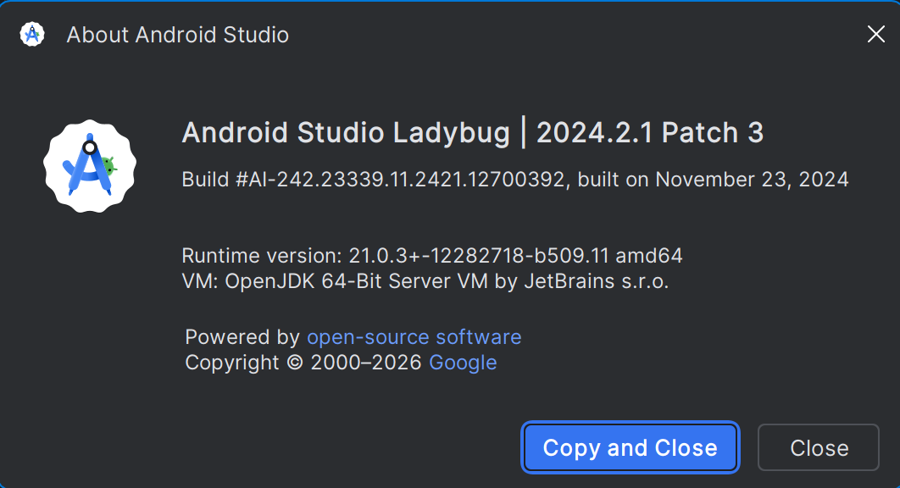
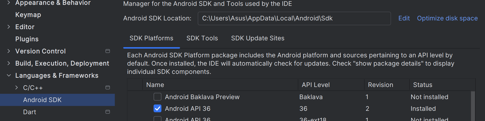
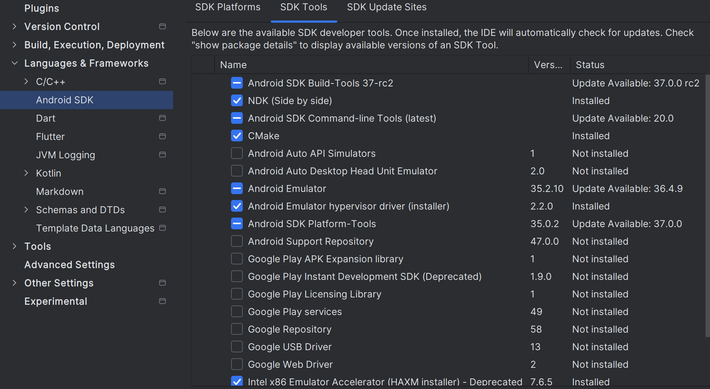

## Hello Vietnam (Flutter) — Setup & Development Guide (Android device)

This repository contains a Flutter app designed to run on a **real Android device** (e.g., Pixel 6a). UI is built in Flutter (Dart) using a **feature-first** folder structure with **4 bottom tabs**: Home, Trip Planner, Messages, Profile. All other modules (Forum, Explore, AI Search, etc.) are reachable from **Home** and open as pushed routes (bottom nav stays intact).

The Flutter app now lives in the `frontend/` folder of the monorepo. Run all Flutter commands from `frontend/`.

---

## 0) Source of truth for tool versions

The team must follow the versions below.

Use exactly:

- **Flutter 3.38.9**
- **Dart 3.10.8**
- **JDK 21** from **Android Studio JBR**
- **Recommended Android Studio:** Ladybug 2024.2.1 Patch 3

Project constraint in `pubspec.yaml`:

```yaml
environment:
  sdk: ">=3.10.8 <3.11.0"
  flutter: "3.38.9"
```

This means:

- Dart 3.10.x only
- Flutter must be 3.38.9
- Do not install the latest stable blindly.

Check:

````bash
flutter --version
dart --version

Verify:

```bash
flutter doctor
````

If your versions are different, fix them before running the project.

## 1) Tech stack

- Flutter (Dart)
- Routing: `go_router`
- Android build: Gradle + Android SDK/NDK
- IDE: Android Studio, VS Code
- Device connection: ADB via Android SDK Platform-Tools

---

## 2) Project structure (what matters)

- `lib/` — **all Flutter code lives here** (UI + logic)
- `lib/app/` — app shell (router, theme, top-level config)
- `lib/core/` — shared, cross-feature utilities and infrastructure
- `lib/features/` — feature modules (Home/Trip Planner/Messages/Profile + other screens)
- `android/` — Android-specific build configuration (**not** where you write Flutter UI)
- `test/` — unit/widget tests

Important:

- Write Flutter UI in lib/
- Do not build Flutter UI inside android/

---

## 3) Requirements (Windows)

Install:

- Flutter SDK 3.38.9
- Android Studio (includes Android SDK tools)
- ADB (comes via Android SDK platform-tools)
- A USB cable that supports **data** (not “charge-only”)

Recommended Android SDK setup:

- Android SDK location: your own local path
- Android platform installed: android-36
- Android Build-Tools: 35.0.0
- Emulator installed
- All Android licenses accepted
  Machine-specific paths must not be committed.

  
  
  

## 4) First-time setup (after cloning)

### 4.1 Clone & install dependencies

```bash
git clone <repo_url>
cd hello-vietnam-1/frontend
flutter pub get
```

### 4.2 Accept Android licenses (if required)

```bash
flutter doctor --android-licenses
```

### 4.3 Pin JDK for Flutter (recommended: Android Studio JBR)

Android Studio includes a bundled JDK (JBR). On Windows it is typically here:
C:\Program Files\Android\Android Studio\jbr

Set it for Flutter:

```bash
flutter config --jdk-dir="C:\Program Files\Android\Android Studio\jbr"
```

Verify:

```bash
"C:\Program Files\Android\Android Studio\jbr\bin\java.exe" -version
```

## 5) Run on a real Android phone (Pixel-like setup)

### 5.1 Enable Developer Options + USB Debugging on the phone

- Settings → About phone → tap Build number 7 times

- Settings → System → Developer options → enable USB debugging

- Plug the phone into the PC and accept the Allow USB debugging RSA prompt.

### 5.2 If the phone is stuck in “Charging only”

On devices:

- Pull down notifications → tap “Charging this device via USB”

- Use USB for → select File transfer

Note: the phone will still charge; “File transfer” enables data mode.

### 5.3 Confirm ADB sees the device

```bash
adb devices
```

Expected status: device
If unauthorized: unlock the phone and accept the RSA prompt.

### 5.4 Run the app

```bash
cd hello-vietnam-1/frontend
flutter run
```

If prompted, select the Android device.

Hot reload:

Press r in the running terminal, or use VS Code’s Hot Reload button.

## 6. Where to code the Android UI (Flutter)

All UI is written in lib/ using Dart.
Do not build Flutter UI inside android/.

Entry points:

- lib/main.dart → calls runApp(const App())

- lib/app/app.dart → MaterialApp.router(...)

- lib/app/router.dart → all routes + bottom navigation

## 7. UI organization (feature-first)

### 7.1 Feature folders

Each module is in:
lib/features/<feature_name>/presentation/...

Examples:

- lib/features/home/presentation/home_page.dart

- lib/features/forum/presentation/forum_page.dart

- lib/features/explore/presentation/explore_page.dart

Naming conventions:

- Screen/page: \*\_page.dart (one file per screen)

- Reusable widgets for that screen: widgets/ inside the feature

### 7.2 Routing rules

4 tabs use StatefulShellRoute.indexedStack (each tab has its own navigation stack)

Non-tab pages (Forum/Explore/AI Search/…) are top-level routes and open via push

Navigation example:

context.push(AppRoutes.forum);

## 8) Adding a new screen (example: Settings under Profile)

### 8.1 Create the page

Create:
lib/features/profile/presentation/settings_page.dart

Minimal example:

```bash
import 'package:flutter/material.dart';

class SettingsPage extends StatelessWidget {
    const SettingsPage({super.key});

    @override
    Widget build(BuildContext context) {
    return Scaffold(
    appBar: AppBar(title: const Text('Settings')),
    body: const Center(child: Text('Settings')),
    );
    }
}
```

### 8.2 Register the route

Edit: lib/app/router.dart

- Add a route constant in AppRoutes

- Add a GoRoute(...) pointing to SettingsPage

### 8.3 Link it from UI

From ProfilePage (or Home):

context.push(AppRoutes.settings);

## 9) lib/core/ folder — what it is and how to use it

core/ contains shared code that is not owned by any single feature.

### 9.1 core/config/

- env.dart: configuration loaded via --dart-define (API base URL, feature flags)

- app_constants.dart: stable constants (standard paddings, keys, app-wide values)

Rules:

- Do not commit secrets.

- Environment-dependent values should come from --dart-define.

### 9.2 core/network/

- api_client.dart: HTTP client wrapper (timeouts, interceptors, logging)

- Central place to normalize network errors (so UI doesn’t handle raw exceptions)

Rule:

- Features should call repositories/services, not raw HTTP clients directly.

### 9.3 core/auth/

auth_repository.dart: cross-feature auth/session utilities (token, logout, attach token)

### 9.4 core/storage/

local_storage.dart: wrapper over SharedPreferences/SecureStorage/local DB (later)

Keeps storage access testable and replaceable.

### 9.5 core/widgets/

Reusable UI components used across features:

EmptyState, LoadingView, ErrorView, shared buttons/inputs, etc.

### 9.6 core/utils/

Pure helpers:

formatting (date/currency), validators, logging utilities

Rule:

Keep utils mostly UI-agnostic where possible.

## 10. Testing (minimum)

Run:

```bash
flutter test
```

If the default counter app was replaced, ensure test/widget_test.dart checks only that the App builds (not the counter behavior).

## 11. Git rules (avoid committing machine-specific files)

Commit:

- lib/, test/, pubspec.yaml, pubspec.lock

- Gradle wrapper:
  - android/gradlew, android/gradlew.bat

  - android/gradle/wrapper/gradle-wrapper.jar

  - android/gradle/wrapper/gradle-wrapper.properties

Do not commit:

- android/local.properties (machine-specific SDK paths)

- android/.gradle/, build/, .dart_tool/

- .idea/, \*.iml (team policy; usually ignored)

## 12. Troubleshooting (quick)

### 12.1 “javaHome invalid / cannot find java.exe”

Pin JDK:

```bash
flutter config --jdk-dir="C:\Program Files\Android\Android Studio\jbr"
```

Stop Gradle daemon + clean:

```bash
cd android
gradlew --stop
cd ..
flutter clean
flutter run
```

If Gradle still uses the wrong Java, check for org.gradle.java.home in:

android/gradle.properties

%USERPROFILE%\.gradle\gradle.properties

### 12.2 NDK error: missing source.properties

Reinstall the exact NDK version via Android Studio:

Android Studio → Settings → Android SDK → SDK Tools

Enable Show Package Details

NDK (Side by side): uninstall the broken version → apply → install again → apply

### 12.3 adb devices shows unauthorized

Unlock phone, accept RSA prompt. If stuck:

```bash
adb kill-server
adb start-server
adb devices
```

## 13) Daily dev workflow

flutter run on the Android device

Edit UI in lib/features/...

Hot reload (r)

Small, focused commits per milestone

If your Android Studio is installed in a different path, update the --jdk-dir accordingly.
